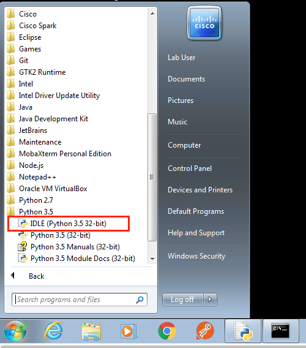

# APIC-EM REST API Part 2 - Path Trace

## Objectives
* Learn about the Path Trace APIC-EM APIs.
* Write custom scripts using Python.

## Prerequisites
* If you are not familiar with APIC-EM APIs, start from Part I - The Basics.
* This lab is based on APIC-EM release 1.3 or later.
* Internet access, so you can send API calls to https://sandboxapicem.cisco.com. Otherwise, you need access to another APIC-EM controller.

* Python version 3.x. (To get Python, see **How To Set up Your Computer**, at the top of this page.)
* Git (To get Git, see [https://git-scm.com/downloads])


## Getting Started
If you are using Cisco-provided hardware at a Cisco event, confirm that the sample code for this lab is in `C:\apicem-apis-with-python-sample-codes\path-trace-labs`.

Otherwise, create a working directory by entering `mkdir \apicem-apis-with-python-sample-codes\path-trace-labs\<UniqueName>`.<br><br>

Download the lab files from GitHub :<br>

  ```
  cd <your working directory>
  ```


If you are in the DevNet Zone at a Cisco Live Event, open the Git command window. Either click the Git icon on the Task bar or type `git cmd` in the run bar.  In the Git command window, enter the following command:

```
git clone https://github.com/CiscoDevNet/apicem-apis-with-python-sample-codes
```

When the `git clone` finishes, you have the lab files.

*  By default, these lab files are configured to send API calls to a sandboxed Cisco DevNet APIC-EM controller at  https://sandboxapicem.cisco.com. If you do not have Internet access, and are using a different controller, locate and open the `apicem_config.py` file in a text editor. Update the **ip** variable with the IP address or hostname of the Cisco APIC-EM controller that you want the scripts to call. For example:

 ```
 ip = https://sandboxapicem.cisco.com
 ```

## Step 1:  Execute lab examples

To run the scripts, follow these steps:

1. Open a terminal and change to the directory that holds the learning lab sample code.  Typically, your working directory is: `apicem-apis-with-python-sample-codes\path-trace`.
2. Invoke Python3, as appropriate for your OS:<br>

### Run the Python scripts

  * On macOS or Linux, enter: `python3 programName`
  * On Windows, enter: `py –3 programName` or `python programName`

>  Alternatively, you can use the Python IDE, IDLE.<br> On macOS, in a terminal, enter: `idle3` to invoke IDLE for Python3.<br>On Windows, select IDLE from the Start menu. See the following figure.</b><br></font>




###  Sample scripts
All Python sample scripts run in a flat directory. You use `apicem\_config.py` to configure parameters for different environments. Those parameters are: APIC-EM IP (including port number), username, password, and the apic-em API version number. If you are using your APIC-EM, modify `apicem_config.py`. <br>
The script `apicem.py` contains common functions. Every script must import `apicem.py`.

---
In Part II, you perform more structured programming using functions.
---

## Next step

Proceed to Step 2: Understand the Network HOST APIs.
