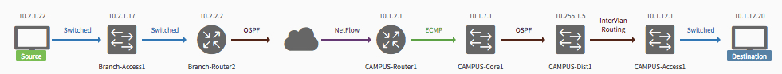

# Step 3: Use Path Trace

## Objectives
*  Learn how to use the `/flow-analysis` API to trace the path that packets take between two network elements (hosts or devices.)
*  Create an application from which the user can select the source and destination IP addresses.  The application will use the `/flow-analysis` API to process these addresses and show the path trace information.

## Task 1 - Create a list of IP addresses (host and network devices)
To perform the path trace, you need the source and destination IP addresses. To get this information, you display the IP addresses for all available devices and hosts, so that the user can choose two addresses from this list. You will use what you learned in previous sessions to create this IP list.

* In Part I, you used the `GET /network-device` API to create a list of network device IP addresses. Use the same API to create a list of network device IP addresses for this lab. Your code for this lab will extract the value of the `managementIpAddress` attribute of each block of the response body and display those IP addresses to the user.

* From the `GET /host` API , you can extract the value of the `hostIp` attribute from each block of the response body and display those IP addresses to the user.

### Code -- Create IP list from `GET /host` and `GET /network-device`


The following code snippet builds the lists of IP addresses of hosts and network devices and prints out both lists. This code does not yet provide user interaction functionality.

[APIC-EM API Reference Docs](https://developer.cisco.com/site/apic-em-rest-api/)

*  Source code file: `lab2-1-get-host-network-device-iplist.py`
*  To run the Python file, enter:

	 *  On Linux or macOS:  `python3 lab2-1-get-host-network-device-iplist.py`
	 *  On Windows:  `py -3 lab2-1-get-host-network-device-iplist.py` or `python lab2-1-get-host-network-device-iplist.py`

**Code listing : `lab2-1-get-host-network-device-iplist.py`**

<details>
<summary><font color='green'><b>lab2-1-get-host-network-device-iplist.py</b></font> - Click to expand</summary>

<pre><code>
"""
Script name: `lab2-1-get-host-network-device-iplist.py`
This script returns all hosts and network devices in a tabular list.

`apicem.py` has functions to request and obtain a token.
`apicem_config.py` is the place where you change the apic-em IP, username, password, and other attributes.
"""

from apicem import * # The apicem_config.py file is the place where you change the apic-em IP, username, password, and other attributes

def get_host_and_device():
    """
    This function returns a list of all hosts and network devices with a number tag.

    Return:
    -------
    list: A list of all hosts and network devices with a number tag
    """
    ip_list=[]
    idx=0
    # Get host
    try:
        resp= get(api="host")
        print ("Status of GET /host: ",resp.status_code)  # This is the http request status
        response_json = resp.json() # Get the json-encoded content from the response
        if response_json["response"] !=[]:
            i=0
            for item in response_json["response"]:
                i+=1
                ip_list.append([i,"host",item["hostIp"]])
            idx=i # idx(sequential number) is used to tag host and network device
    except:
        print ("Something went wrong. Cannot get the host IP list")
    # So far, "ip_list" contains all hosts

    # Now get the network device and append it to the list    
    try:
        resp= get(api="network-device")
        print ("Status: of GET /network-device ",resp.status_code)  # This is the http request status
        response_json = resp.json() # Get the json-encoded content from response
        if response_json["response"] !=[]:
            for item in response_json["response"]:
                idx+=1
                ip_list.append([idx,"network device",item["managementIpAddress"]])   
    except:
        print ("Something went wrong! Cannot get the network device IP list !")
    # Now "ip_list" should contain hosts and network devices

    if ip_list !=[]:
        return ip\_list
    else:
        print ("There is no host or network device!")
        sys.exit()

######################################################################################################

if \_\_name\_\_ == "\_\_main\_\_": # Only run as a script
    # Use the tabulate module here to print a nice table format. You can use the `pip` tool to install it on your local computer
    # The tabulate module is imported in apicem.py
    # For simplicity, copy the source code into your working directory, without installing it
    print (tabulate(get_host_and_device(),headers=['number','type','ip'],tablefmt="rst"))

</code></pre>
</details>

<details>
<summary><font color='green'><b>Output</b></font> - Click to expand</summary>

<pre><code>
Executing GET 'https://sandboxapicem.cisco.com/api/v1/host'

GET 'host' Status:  200

Status of GET /host:  200

Executing GET 'https://sandboxapicem.cisco.com/api/v1/network-device'

GET 'network-device' Status:  200

Status: of GET /network-device  200
========  ==============  =============
  number  type            ip
========  ==============  =============
       1  host            10.1.15.117
       2  host            10.2.1.22
       3  host            10.1.12.20
       4  network device  165.10.1.39
       5  network device  10.1.14.3
       6  network device  10.2.1.17
       7  network device  10.2.2.1
       8  network device  10.2.2.2
       9  network device  218.1.100.100
      10  network device  10.1.12.1
      11  network device  10.1.7.1
      12  network device  10.1.10.1
      13  network device  10.255.1.5
      14  network device  10.1.11.1
      15  network device  10.1.2.1
      16  network device  10.1.4.2
      17  network device  10.1.14.2
========  ==============  =============
</code></pre>
</details>

After displaying this list, you can add code that prompts the user to select source/destination IP addresses from the list. Because the user-prompt code is based on code that is similar to what you wrote in Part I, it isn't covered again.

With these pieces in place, you are now able to pass the user-selected IP addresses to the `/flow-analysis` API to generate path-trace information.

## Task 2 - Create the path-trace application

Flow analysis is a task-based, multi-step process. Your path-trace application takes the following steps to compute the path between the user-specified IP addresses:

* A. Issues the `POST /flow-analysis` request with user-selected IP addresses
* B. Uses the `GET /flow-analysis/{flowAnalysisId}` API to monitor status of the `POST /flow-analysis`.
* C. When the `GET /flow-analysis/{flowAnalysisId}` status attribute is "COMPLETED" then the response from `GET /flow-analysis/{flowAnalysisId}` contains the result you want.


### A. Issue the POST /flow-analysis request

The `POST /flow-analysis ` API takes five-tuple input (two IP addresses, two ports, one protocol):

```
PathRequest {
protocol (string, optional): Protocol,
sourcePort (string, optional): Source Port,
destPort (string, optional): Destination Port,
sourceIP (string): Source IP address,
destIP (string): Destination IP address
}
```
The `sourceIP` and `destIP` variables must have IP addresses assigned to them.  There are other optional values, but specifying the path as a five-tuple can help to eliminate ambiguity when more than one possible path between the elements exists.

Your call to this API uses the `sourceIP/destIP` that the user selected from the IP list created in Step 1 of this session.

### B. Use `GET /flow-analysis/{flowAnalysisId}` to monitor `POST /flow-analysis` request status

The `GET /flow-analysis/{flowAnalysisId}` request returns a status of `POST /flow-analysis`.

* status : `COMPLETED`. A path trace is created.
* status : `INPROGRESS`. The task is not finished yet.
* status : `FAILED`. For some reason, APIC-EM was unable to find the full path.


### C. Wait for the status to be `COMPLETED`

When the `status` attribute in the response from `GET /flow-analysis/{flowAnalysisId}` is `COMPLETED`, then that response contains all of the information you need for the path trace.


### Code -- The complete example application

The following code listing puts together the following APIs to create the simple application that is described in the objectives section of this Learning Lab.

* `GET /host`
* `GET /network-device`
* `POST /flow-analysis`
* `GET /flow-analysis/{flowAnalysisId}`

For more information, see [APIC-EM API Reference Docs](https://developer.cisco.com/site/apic-em-rest-api/)

### Source code recap
1. Use `GET /host` and `GET /network-device` to build a list of IP addresses.
2. Prompt the user to enter the source/destination IP from the list.
3. Use the source/destination IP pair for `POST /flow-analysis`.
4. Use `GET /flow-analysis/{flowAnalysisId}` to monitor the progress of `POST /flow-analysis`.
5. Retrieve the path trace information when the status is `COMPLETED`. If the status is `FAIL` or the script times out, then the full path was not found.

* Source code file: `lab2-2-get-path-trace-with-flowAnalysisId.py`
* To run the Python file, enter:

	*  On Linux or macOS: `python3 lab2-2-get-path-trace-with-flowAnalysisId.py`
	*  On Windows: `py -3 lab2-2-get-path-trace-with-flowAnalysisId.py` or `python lab2-2-get-path-trace-with-flowAnalysisId.py`

**Code listing : `lab2-2-get-path-trace-with-flowAnalysisId.py`**

<details>
<summary><font color='green'><b>lab2-2-get-path-trace-with-flowAnalysisId.py</b></font> - Click to expand</summary>

<pre><code>
"""
Script name: `lab2-2-get-path-trace-with-flowAnalysisId.py`
This script prints out APIC-EM path trace information between the source and destination host (network device).
"""
from apicem import \* # APIC-EM IP is assigned in apicem_config.py
import threading,time # This is needed for the delay - sleep() function

def check_status(arg,arg1):
    """
    Non-blocking wait function to check POST /flow-analysis status:
    INPROGRESS, COMPLETED, FAILED

    Parameters
    ----------
    arg (str) : status of POST /flow-analysis
    arg1 (str): flowAnalysisId from POST /flow-analysis
    Return:
    -------
    None
    """
    status = arg
    flowAnalysisId = arg1
    count = 0
    while status != "COMPLETED":
        if status == "FAILED":
            print("Unable to find the full path. No traceroute or netflow information was found. The path calculation failed.")
            print("\n------ End of path trace ! ------")
            sys.exit()
        print ("\nTask is not finished yet, sleep 1 second then try again")
        time.sleep(1)
        count += 1
        if count > 30: # timeout after ~ 30 seconds
            print ("\nScript timed out. No routing path was found. Please try using a different source and destination !")
            print("\n------ End of path trace ! ------")
            sys.exit()
        try:
            r = get(api="flow-analysis/"+flowAnalysisId)
            response_json = r.json()
            print ("Response from GET /flow-analysis/"+flowAnalysisId,json.dumps(response_json,indent=4))
            status = response_json["response"]["request"]["status"]
            print ("\n**** Check status here: ",status," ****\n")
        except:
            # Something is wrong
            print ("\nSomething went wrong while running get /flow-analysis/{flowAnalysisId}")
    print("\n------ End of path trace ! ------")

def get_host_and_device():
    """
    This function returns a list of all hosts and network devices with a number tag.

    Return:
    ------
    list: A list of all hosts and network devices with a number tag
    """
    ip_list=[]
    idx=0
    # Create a list of host and network device
    # Get host
    try:
        resp= get(api="host")
        response_json = resp.json() # Get the json-encoded content from the response
        i=0
        if response_json["response"] !=[]:
            for item in response_json["response"]:
                i+=1
                ip_list.append([i,"host",item["hostIp"]])
            idx=i # This idx(sequential number) is used to tag host and network device
                  # So far this number = the number of hosts
    except:
        print ("Something went wrong. Cannot get the host IP list")

    # Now get the network device and append it to the list    
    try:
        resp= get(api="network-device")
        print ("Status: of GET /network-device ",resp.status_code)  # This is the http request status
        response_json = resp.json() # Get the json-encoded content from response
        if response_json["response"] !=[]:
            for item in response_json["response"]:
                idx+=1
                ip_list.append([idx,"network device",item["managementIpAddress"]])   
    except:
        print ("Something went wrong! Cannot get the network device IP list!")
    # Now "ip_list" should have hosts and network devices
    return ip_list

def select_ip(prompt,ip_list,idx):
    """
    This function returns an element that the user-selected from a tabular list

    Parameters
    ----------
    prompt: str
        A message used to prompt the user
    ip_list: list
        A list with idx that enables a user to make a selection
    idx: int
        The position of the element to retrieve from the list

    Return:
    -------
    str: The user selected IP address
    """

    ip =""
    while True:
        user_input = input(prompt)
        user_input= user_input.lstrip() # Ignore leading space
        if user_input.lower() == 'exit':
            sys.exit()
        if user_input.isdigit():
            if int(user_input) in range(1,len(ip_list)+1):
                ip = ip_list[int(user\_input)-1][idx] # The idx is the position of IP
                return ip
            else:
                print ("Oops! The number you selected is out of range. Please try again or enter 'exit'")
        else:
            print ("Oops! The input you entered is not a number. Please try again or enter 'exit'")
    # End of while loop

##########################################################################

if \_\_name\_\_ == "\_\_main\_\_": # Only run as a script
    ip_idx = 2
    nd_list = get_host_and_device()
    if len(nd_list) < 2:
        print ("You need at least two hosts or network devices to perform a path trace!")
        sys.exit()

    print (tabulate(nd_list,headers=['number','type','ip'],tablefmt="rst"))
    print ("*** Note: Not all source/destination ip address pairs will return a path. No route! *** \n")
    s_ip = select_ip('=> Select a number for the source IP from the list shown: ',nd_list,ip_idx) # ip_idx (=2) is the position of IP in the list
    d_ip = select_ip('=> Select a number for the destination IP from the list shown: ',nd_list,ip_idx) # ip_idx (=2) is the position of IP in the list
    # Now that you have the source and destination IP addresses you can use them to POST /flow-analysis
    path_data = {"sourceIP": s_ip, "destIP": d_ip} # JSON input for POST /flow-analysis
    r = post(api="flow-analysis",data=path_data) # Run POST /flow-analysis
    response_json = r.json()
    print ("Response from POST /flow-analysis:\n",json.dumps(response_json,indent=4))
    try:
       flowAnalysisId = response_json["response"]["flowAnalysisId"]
    except:
        print ("\n For some reason, you cannot get the flowAnalysisId")
        sys.exit()

    ###########################################################
    # Check status of POST /flow-analysis - non-blocking wait #
    ###########################################################
    thread = threading.Thread(target=check_status, args=('',flowAnalysisId,)) # Passing <status = ''>
    thread.start()

</code></pre>
</details>

<details>
<summary><font color='green'><b>Output</b></font> - Click to expand</summary>

<pre><code>
Executing GET 'https://sandboxapicem.cisco.com/api/v1/host'

GET 'host' Status:  200


Executing GET 'https://sandboxapicem.cisco.com/api/v1/network-device'

GET 'network-device' Status:  200

Status: of GET /network-device  200
========  ==============  =============
  number  type            ip
========  ==============  =============
       1  host            10.1.15.117
       2  host            10.2.1.22
       3  host            10.1.12.20
       4  network device  165.10.1.39
       5  network device  10.1.14.3
       6  network device  10.2.1.17
       7  network device  10.2.2.1
       8  network device  10.2.2.2
       9  network device  218.1.100.100
      10  network device  10.1.12.1
      11  network device  10.1.7.1
      12  network device  10.1.10.1
      13  network device  10.255.1.5
      14  network device  10.1.11.1
      15  network device  10.1.2.1
      16  network device  10.1.4.2
      17  network device  10.1.14.2
========  ==============  =============
*** Please note that not all source/destination ip pairs will return a path - no route! ***

=> Select a number for the source IP from the list shown: 2
=> Select a number for the destination IP from the list shown: 3

Executing POST 'https://sandboxapicem.cisco.com/api/v1/flow-analysis'

POST 'flow-analysis' Status:  202

Response from POST /flow-analysis:
 {
    "response": {
        "taskId": "f63a0272-fcec-46a5-810e-890582267faf",
        "url": "/api/v1/flow-analysis/74e5d00f-2bb1-4599-ae1c-187c7ad7526a",
        "flowAnalysisId": "74e5d00f-2bb1-4599-ae1c-187c7ad7526a"
    },
    "version": "1.0"
}

Task is not finished yet. Sleep 1 second then try again
>>>

Executing GET 'https://sandboxapicem.cisco.com/api/v1/flow-analysis/74e5d00f-2bb1-4599-ae1c-187c7ad7526a'

GET 'flow-analysis/74e5d00f-2bb1-4599-ae1c-187c7ad7526a' Status:  200


**** Check status here:  INPROGRESS  ****


Task is not finished yet. Sleep 1 second then try again

Executing GET 'https://sandboxapicem.cisco.com/api/v1/flow-analysis/74e5d00f-2bb1-4599-ae1c-187c7ad7526a'

GET 'flow-analysis/74e5d00f-2bb1-4599-ae1c-187c7ad7526a' Status:  200


**** Check status here:  INPROGRESS  ****


Task is not finished yet. Sleep 1 second then try again

Executing GET 'https://sandboxapicem.cisco.com/api/v1/flow-analysis/74e5d00f-2bb1-4599-ae1c-187c7ad7526a'

GET 'flow-analysis/74e5d00f-2bb1-4599-ae1c-187c7ad7526a' Status:  200


**** Check status here:  COMPLETED  ****

Response from GET /flow-analysis/74e5d00f-2bb1-4599-ae1c-187c7ad7526a {
    "response": {
        "request": {
            "sourceIP": "10.2.1.22",
            "destIP": "10.1.12.20",
            "id": "74e5d00f-2bb1-4599-ae1c-187c7ad7526a",
            "status": "COMPLETED",
            "periodicRefresh": false,
            "createTime": 1485902324568,
            "lastUpdateTime": 1485902331975
        },
        "lastUpdate": "Tue Jan 31 22:38:54 UTC 2017",
        "networkElementsInfo": [
            {
                "id": "f624d4f3-0ab9-4ae3-b09d-62051edbd8f3",
                "type": "wired",
                "ip": "10.2.1.22",
                "linkInformationSource": "Switched"
            },
            {
                "linkInformationSource": "Switched",
                "ingressInterface": {
                    "physicalInterface": {
                        "id": "7075521d-4d7b-4218-92f9-79b60e054635",
                        "name": "GigabitEthernet1/0/47"
                    }
                },
                "type": "Switches and Hubs",
                "name": "Branch-Access1",
                "ip": "10.2.1.17",
                "egressInterface": {
                    "physicalInterface": {
                        "id": "05186c34-2ed8-4db4-bba3-ac9c2b68ad90",
                        "name": "GigabitEthernet1/0/1"
                    }
                },
                "id": "26450a30-57d8-4b56-b8f1-6fc535d67645",
                "role": "ACCESS"
            },
            {
                "linkInformationSource": "OSPF",
                "ingressInterface": {
                    "physicalInterface": {
                        "id": "1b46c64c-bb92-4998-bee2-283118075156",
                        "name": "GigabitEthernet0/2"
                    }
                },
                "type": "Routers",
                "name": "Branch-Router2",
                "ip": "10.2.2.2",
                "egressInterface": {
                    "physicalInterface": {
                        "id": "0b3b2b54-e7c6-4d03-bca8-27e9c0c0b272",
                        "name": "GigabitEthernet0/0"
                    }
                },
                "id": "6ce631db-9212-4587-867f-b8f3aed1702d",
                "role": "BORDER ROUTER"
            },
            {
                "id": "UNKNOWN",
                "name": "UNKNOWN",
                "ip": "UNKNOWN",
                "role": "UNKNOWN",
                "linkInformationSource": "NetFlow"
            },
            {
                "linkInformationSource": "ECMP",
                "ingressInterface": {
                    "physicalInterface": {
                        "id": "6dc56935-8268-45e4-acaa-de1c15a8832d",
                        "name": "GigabitEthernet0/0/1"
                    }
                },
                "type": "Routers",
                "name": "CAMPUS-Router1",
                "ip": "10.1.2.1",
                "egressInterface": {
                    "physicalInterface": {
                        "id": "43ee5993-b8a0-4ed8-8c1b-376273834582",
                        "name": "GigabitEthernet0/0/0"
                    }
                },
                "id": "9712ab62-6140-43fd-b1ee-1b07d1fb67d7",
                "role": "BORDER ROUTER"
            },
            {
                "linkInformationSource": "OSPF",
                "ingressInterface": {
                    "physicalInterface": {
                        "id": "6df9d717-5c7a-479e-a595-563480aaada0",
                        "name": "GigabitEthernet1/2"
                    }
                },
                "type": "Switches and Hubs",
                "name": "CAMPUS-Core1",
                "ip": "10.1.7.1",
                "egressInterface": {
                    "physicalInterface": {
                        "id": "f8a45bfd-0e1f-4f3e-b56c-150e3a9fc103",
                        "name": "GigabitEthernet1/1"
                    }
                },
                "id": "30d39b18-9ada-4148-ad6c-2ee20975b845",
                "role": "CORE"
            },
            {
                "linkInformationSource": "InterVlan Routing",
                "ingressInterface": {
                    "physicalInterface": {
                        "id": "729002b4-a1cd-4700-a2f9-b68cbdfe2f70",
                        "name": "GigabitEthernet5/7"
                    }
                },
                "type": "Switches and Hubs",
                "name": "CAMPUS-Dist1",
                "ip": "10.255.1.5",
                "egressInterface": {
                    "virtualInterface": [
                        {
                            "id": "4adadf2b-d496-4d70-96e6-ad1bc0855bae",
                            "name": "Vlan200"
                        }
                    ],
                    "physicalInterface": {
                        "id": "b10dcdea-1675-4509-b554-f047f6a37595",
                        "name": "GigabitEthernet5/5"
                    }
                },
                "id": "c8ed3e49-5eeb-4dee-b120-edeb179c8394",
                "role": "DISTRIBUTION"
            },
            {
                "linkInformationSource": "Switched",
                "ingressInterface": {
                    "physicalInterface": {
                        "id": "38c72319-855e-43bc-8458-94f695d435b6",
                        "name": "GigabitEthernet1/0/1"
                    }
                },
                "type": "Switches and Hubs",
                "name": "CAMPUS-Access1",
                "ip": "10.1.12.1",
                "egressInterface": {
                    "virtualInterface": [
                        {
                            "id": "6ca61e1e-89b8-4093-9294-f530a794cde3",
                            "name": "Vlan200"
                        }
                    ],
                    "physicalInterface": {
                        "id": "6e4e5ae6-6045-4060-9038-1a64d5a101cc",
                        "name": "GigabitEthernet1/0/47"
                    }
                },
                "id": "5b5ea8da-8c23-486a-b95e-7429684d25fc",
                "role": "ACCESS"
            },
            {
                "id": "572d4065-abd8-4b97-bfc3-ab5ee13f6c08",
                "type": "wired",
                "ip": "10.1.12.20"
            }
        ],
        "detailedStatus": {
            "aclTraceCalculation": "SUCCESS"
        }
    },
    "version": "1.0"
}

------ End of path trace ! ------

</code></pre>
</details>

### Output walkthrough

1. A list of host and network device IP addresses are displayed using `GET /host` and `GET /network-device`.
2. `sourceIP = 10.2.1.22` and `destIP = 10.1.12.20` are selected by the user.
3. `sourceIP = 10.2.1.22` and  `destIP = 10.1.12.20` are then passed to `POST /flow-analysis` returning `flowAnalysisId` =  `d8a9047f-bd87-4305-ac2b-e45e0d903dec`.
4. `GET /flow-analysis/{flowAnalysisId}` is used to monitor the progress of `POST /flow-analysis`.
5. From the `request["status"]` attribute in the response from `GET /flow-analysis/flowAnalysisId` you can monitor the `POST /flow-analysis` request status.
6. When the `POST /flow-analysis` task completes, you can then see from the "networkElementsInfo" attribute in the response from `GET /flow-analysis/flowAnalysisId` that the routing path started from host 10.2.1.22, reached the Branch-Access1 switch with IP=10.2.1.17, and finally arrived at the host with IP=10.1.12.20, which is the destination.

## Session summary

You learned how to use the `POST /flow-analysis` API to trace a path between two IP addresses. You learned that the `POST /flow-analysis` API is a task-based API that requires the use of the `GET  /flow-analysis/{flowAnalysisId}` API to check the status of the request.  You used `GET /flow-analysis/{flowAnalysisId}` to get the final result of the `POST /flow-analysis` request. These steps match the following main sections of this lab:

* A. Use `POST /flow-analysis`.
* B. Use the `GET /flow-analysis/{flowAnalysisId}` API to monitor the `POST /flow-analysis` request status.
* C. You should get either `COMPLETED` or `FAIL` as the status from `GET /flow-analysis/{flowAnalysisId}` when the task of POST /flow-analysis is finished. If it cannot get the result in 20 seconds, the script will time out.

Although this example is text-based for the sake of simplicity, what you learned in this session can be used in an application that shows path trace results graphically, like the following example. This screen is from the `Path Trace` application in the Cisco APIC-EM GUI, which uses these very same APIs to do its work.



### <font color='red'>Note: Because you are using database-only Sandbox, not all source/destination pairs are able to retrieve the trace path. </font>

### Congratulations!  You've completed Part II of APIC-EM REST API Learning Labs
