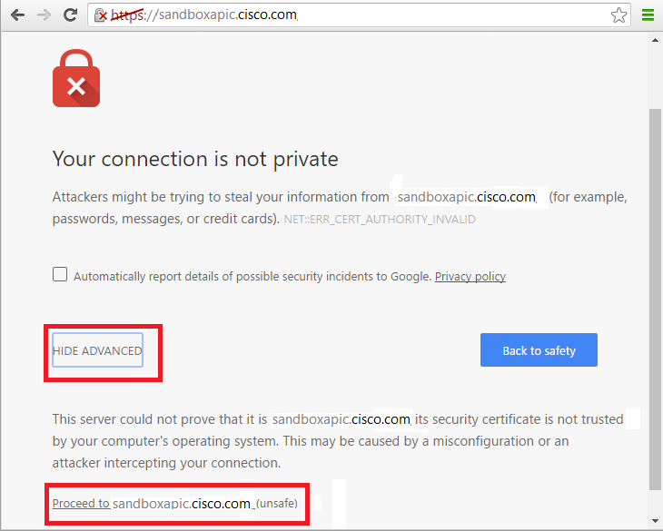
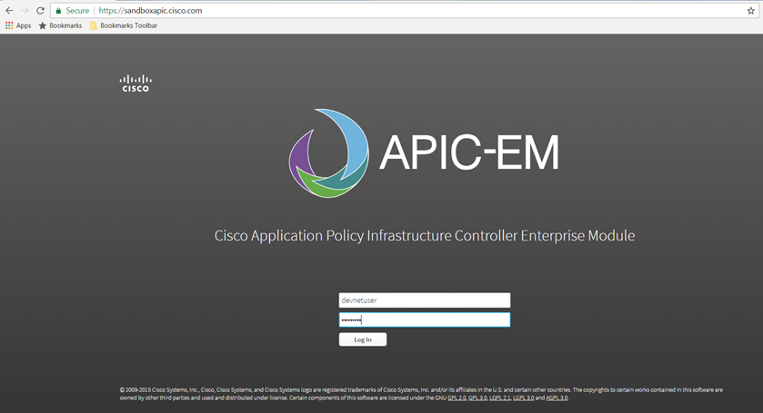
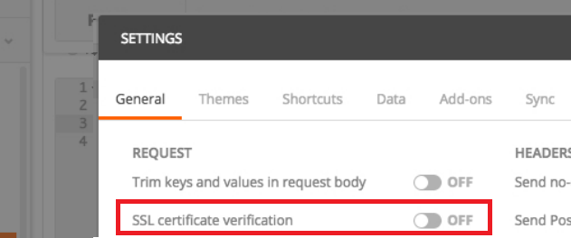

# APIC-EM REST API with Postman and Python applications

APIC-EM's Northbound (NB) REST-based API enables Network Engineers and Operators to communicate with the controller using custom-built applications to respond more rapidly to changing network conditions and related business opportunities.

The APIC-EM southbound interface speaks to the network's control plane and is not directly accessible. It runs commands on the underlying networking devices that were specified using the Northbound (NB) REST API. Thus, applications can be written to communicate with APIC-EM and add dynamic SDN functionality directly into the network.

This lab shows how to use Python to interact with the Cisco APIC-EM Northbound REST API.

## Objectives

* Learn how to use Postman REST Client to generate Python code.
* Write custom scripts using Python.

## Prerequisites

* In this module, you are going to use <a href="https://www.getpostman.com" target="_blank">Postman</a> to make the REST API calls and <a href="https://www.python.org/downloads/" target="_blank">Python3</a> as the programming language.

* For more information, see "How to Set up Your Computer" near the top of this page.

**Access to an APIC-EM Controller**

- To interface with the APIC-EM API, you need access to an APIC-EM controller.
- By default, these labs are configured to use an APIC-EM Controller provided by the <a href=""https://devnetsandbox.cisco.com/RM/Topology target="_blank">Cisco DevNet Sandbox.</a>
	- You will use the Always-on APIC-EM Sandbox located at [https://sandboxapicem.cisco.com](https://sandboxapicem.cisco.com)
  - The login credentials for the controller are **username:** `devnetuser` and **password:** `Cisco123!``

## Step 1: Connect to APIC-EM

In a browser, open [https://sandboxapicem.cisco.com](https://sandboxapic.cisco.com). If an SSL Certification warning page is displayed bypass the warning. To proceed, click the **Advanced** button then click the **Proceed to sandboxapic.cisco.com** link.

On the login page, enter **username:** `devnetuser` and **password:** `Cisco123!`.

If you are using Postman on a Mac computer, turn off SSL verification:
1. In Postman, click the **Wrench** icon.
2. From the drop down menu, select **Settings**.

3. In the popup window, under the **General** tab, turn off **SSL certificate verification**. If you don't see this option, don't worry about it and close the window.

Next, you generate Python code using the <a href="https://www.getpostman.com/" target="_blank">Postman</a> application.

## Next step

Proceed to Step 2: Generate code using Postman.
