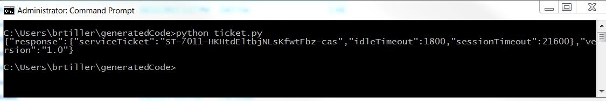
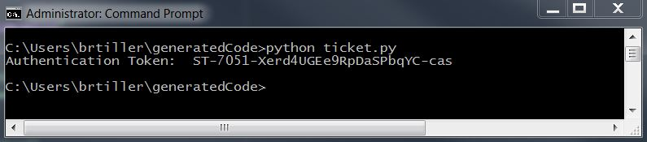

# Step 3: Write a Python script

Now, you learn how to write code that calls the APIC-EM API. Like the previous step, the code in this step makes a call to the APIC-EM controller's `/ticket` API to generate an authentication token.


To make API calls, start your Python script by importing `requests` and `json`, as shown here.

```
python
# Import the modules required to make API calls
import requests
import json
```

**Note:** Technically, you do not need to import the `json` module because the `requests` module already imports it. For example, you can pass JSON data to a POST method by calling `requests.post` with the `json=variable` parameter (instead of using `data=json.dumps(variable)`). Nonetheless, it makes sense to import `json` so you can call its methods, such as `loads()` and `dumps()`, directly.

Optionally, you can turn off SSL certificate warning messages by adding the line shown here.

```
python
# Disable warnings
requests.packages.urllib3.disable_warnings()
```

Now, define the variables your code will use and combine them.

```
python
# Variables
apic_em_ip = "https://sandboxapicem.cisco.com/api/v1"
api_call ="/ticket"

# Combine these variables into one variable
url = apic_em_ip + api_call
```

Define the payload and header using key-value pairs.

```
python
# Payload with authentication information
payload = {"username":"devnetuser","password":"Cisco123!"}

# Headers
headers = {"content-type" : "application/json"}
```

Assign the response from the APIC-EM controller to a variable, `response`, and display it.

```
python
# Assign the response to a variable
response = requests.post(url, data=json.dumps(payload), headers=headers, verify=False)

# Print the response body
print(response.text)

```

Here's what the completed text should look like:

```
python
# Import the modules required to make API calls
import requests
import json

# Disable warnings
requests.packages.urllib3.disable_warnings()

# Variables
apic_em_ip = "https://sandboxapicem.cisco.com/api/v1"
api_call ="/ticket"

# Combine these variables into one variable
url = apic_em_ip + api_call

# Payload with authentication information
payload = {"username":"devnetuser","password":"Cisco123!"}

# Headers
headers = {"content-type" : "application/json"}

# Assign the response to a variable
response = requests.post(url, data=json.dumps(payload), headers=headers, verify=False)

# Print the response body
print(response.text)
```


- Your code is ready to be used. Save the script to your working directory as a Python file (`*.py`).
- To run the code, open a terminal, locate your working directory, and enter the `python` command that's appropriate for your operating system, such as `python <FILE-NAME.py>`. If everything works, the terminal displays a response similar to the one shown here.

    

To make this output more readable, update your code. Add `.json()` to end of the `response` line, so it looks like this:

  ```
  python
  response = requests.post(url, data=json.dumps(payload), headers=headers, verify=False).json()
  ```

Replace `print(response.text)` with `print("Authenticaton Token: " + response["response"]["serviceTicket"])` so the line prints the value of the authentication token only.

Save the changes and run the script again. The output will be much cleaner and more readable.



### Congratulations! You've written Python code that makes a REST API call and retrieves information from APIC-EM.

In the next step, you build an application that lets you select a networking device from APIC-EM's inventory list, gets the device's running configuration, and saves it to a file.

## Next step

Proceed to Step 4: Build the Python application.
