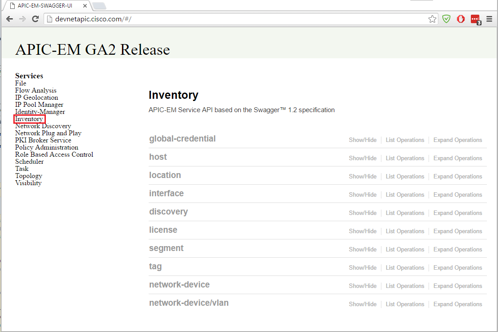
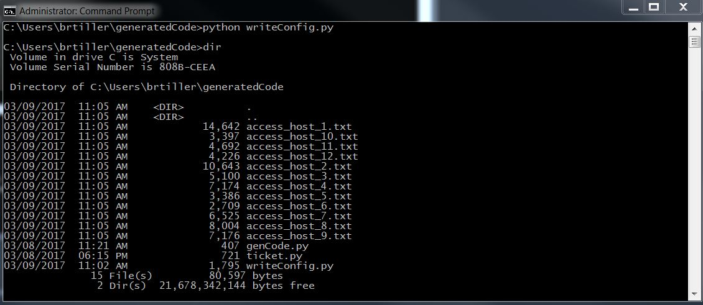
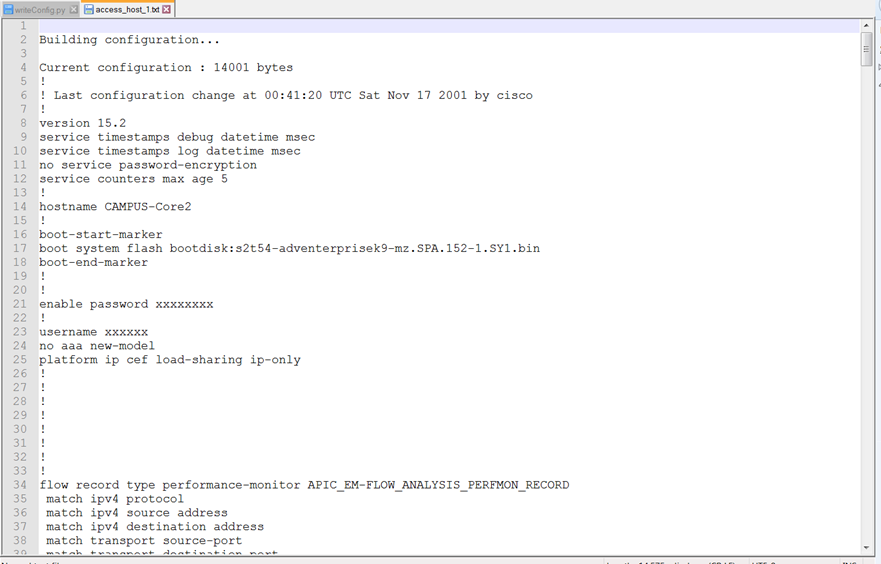
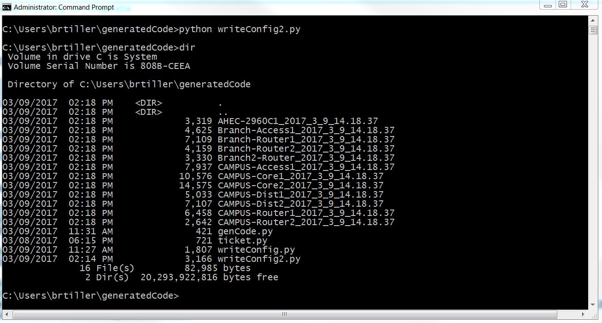

# Step 4: Build the Python application

In this step, you build an application that lets you select a networking device from APIC-EM's inventory list, gets the device's running configuration, and saves it to a file.

To make API calls, you need to know which method to use and what information to include in the request. To get this information, see the [APIC-EM API documentation](https://developer.cisco.com/site/apic-em-rest-api/).

Most of the API calls in this application are grouped under the **Inventory** category. Please take a minute to review its contents.



To build the application:

Using the code from the previous step, define a `get_token()` function and indent the code below it, as shown here.

```
python
def get_token(url):
    # Define a variable
    api_call ="/ticket"

    # Payload contains authentication information
    payload = { "username": "devnetuser", "password": "Cisco123!" }

    # Header information
    headers = {"content-type" : "application/json"}

    # Combine URL, API call variables
    url +=api_call

    response = requests.post(url, data=json.dumps(payload), headers=headers, verify=False).json()

    # Return authentication token from respond body
    return response["response"]["serviceTicket"]
```

The  `get_token()` function shown takes an argument, the URL of the APIC-EM's controller. It returns an authentication token that's required to call other API calls.

Create a new function that takes two arguments: the authentication token and the URL of the APIC-EM controller. This function will query the APIC-EM controller to get the running configuration for network devices.

```
python
def get_config(token, url):

    # Define a variable for the API call to get the network configurations of all devices
    api_call = "/network-device/config"

    # Header
    headers = {"X-AUTH-TOKEN": token}

    # Add the API call to the URL argument
    url += api_call

    response = requests.get(url, headers=headers, verify=False).json()
    count=1
    for data in response['response']:
        filename="access_host_" + str(count) +".txt"

        # Create a file in present working directory
        file = open(filename, 'w')

        # write json data from runningConfig key
        file.write(data['runningConfig'])

        # Close the file when writing is complete
        file.close()
        count+=1
```

Good! You've created all of your functions. Now, put everything together. Your code should look like the following example.


```
python
# Import modules.
import requests
import json

# Disable warnings.
requests.packages.urllib3.disable_warnings()

# Variables
apic_em_ip = "https://sandboxapicem.cisco.com/api/v1"

def get_token(url):

    # Define API Call to get authentication token.
    api_call ="/ticket"

    # Payload contains authentication information.
    payload = { "username": "devnetuser", "password": "Cisco123!" }

    # Header information.
    headers = {"content-type" : "application/json"}

    # Add the API call to the URL argument.
    url +=api_call

    response = requests.post(url, data=json.dumps(payload), headers=headers, verify=False).json()

    # Return authentication token from respond body.
    return response["response"]["serviceTicket"]


def get_config(token, url):

    # Define the API Call. Get configuration for all network devices.    
    api_call = "/network-device/config"

    # Header
    headers = {"X-AUTH-TOKEN": token}

    # Combine URL, API call variables.
    url += api_call

    response = requests.get(url, headers=headers, verify=False).json()
    count=1
    for data in response['response']:
        filename="access_host_" + str(count) +".txt"

        # Create a file in present working directory.
        file = open(filename, 'w')       

        # write json data from runningConfig key.
        file.write(data['runningConfig'])

        # Close the file when writing is complete.
        file.close()
        count+=1

# Assign obtained authentication token to a variable. Provide APIC-EM's URL address.
auth_token = get_token(apic_em_ip)

# Call get_config() function to obtain and write each network device's configuration to a separate file.
#Provide authentication token, APIC-EM's URL address
get_config(auth_token, apic_em_ip)

```

Save this code to a Python file.

Open a terminal and navigate to the directory where the Python file is located. Run the script by entering `python <FILE-NAME.py>`.  In OS X or Linux enter: `python3 <FILE-NAME.py>`. If everything was done correctly, you should see a new prompt on the terminal screen. It means there were no errors while running the code.

In the terminal, check the folder contents again. You should see several new files titled `access_host_##.txt`. Where **##** is the file number.  These files were created by your application.



To check the `access_host_##.txt` file contents, open one of the files in a text editor, or print the contents in the terminal.



Good! Your application works!


## Improve the application

Instead of naming the output files `access_host_##.txt`, a better practice would be to name the file using:
* The hostname of the device from which the configuration was obtained.
* The date and time when the configuration was saved.

This way, you can back up the configuration of every device on the network within seconds. These files can serve as a change control mechanism to see what changed on a particular device at a given time.

To implement this idea, slightly modify your code:

1. Import two new modules:
  * The **re** module captures the hostname of the device.
  * The **datetime** module provides the current date and time.

    ```
    python
    #Import necessary modules
    import requests
    import json
    import datetime
    import re
    ```

2. Modify the `get_config()` function so it captures the hostname of each device. Also, change the filename to the new format. There are various ways to capture the hostname of the device, but using a regular expression is the fastest and most convenient way. The modified function should look like this:

    ```
    python
    def get_config2(token, url):

        # Define API Call. To get specific device's configuration.
        # Add device's ID in the API call.
        api_call = "/network-device/config"

        # Header information.
        headers = {"X-AUTH-TOKEN": token}

        # Combine URL, API call variables.
        url += api_call

        response = requests.get(url, headers=headers, verify=False).json()

        for data in response['response']:
            # Find the hostname in the response body and save it to a hostname variable.
            hostname = re.findall('hostname\s(.+?)\s', data['runningConfig'])[0]

            # Create a date_time variable which will hold current time.
            date_time = datetime.datetime.now()

            # Create a variable which will hold the hostname combined with the date and time.
            # The format will be hostname_year_month_day_hour.minute.second
            filename = hostname + '_' + str(date_time.year) + '_' + str(date_time.month) + '_' + str(date_time.day) + '_' + str(date_time.hour) + '.' + str(date_time.minute) + '.' + str(date_time.second)

            # Create a file in present working directory.
            file = open(filename, 'w')       
            file.write(data['runningConfig'])
            # Close the file when writing is complete.
            file.close()
    ```
3. Save these changes to your Python script and run it again.  

4. Now, view the newly created list of files.




Congratulations! You wrote an application that backs up device configurations.
